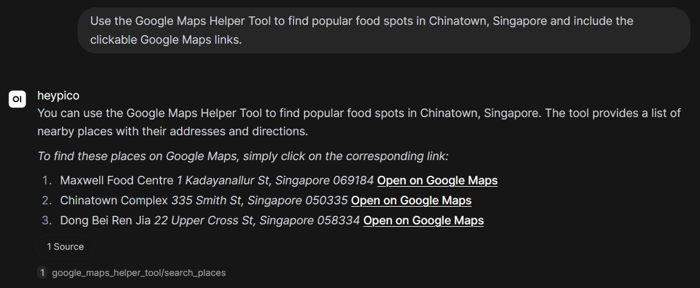
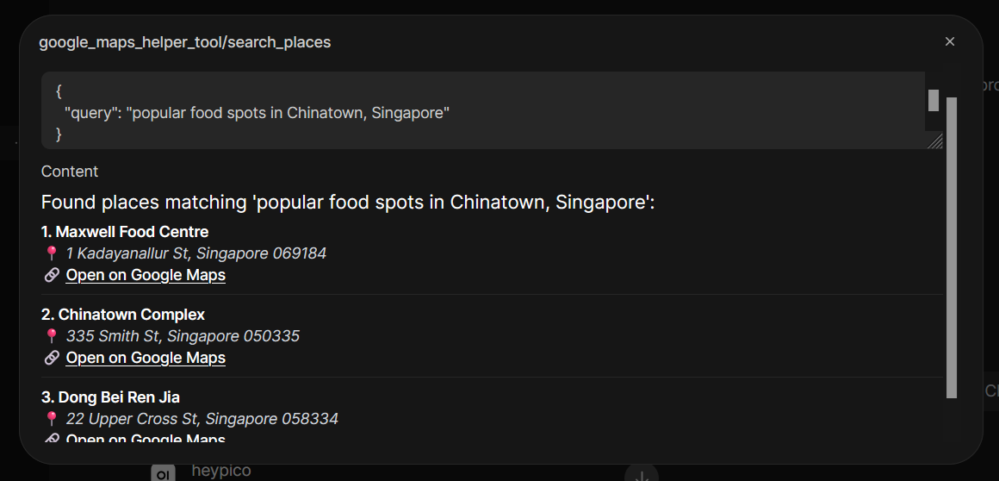
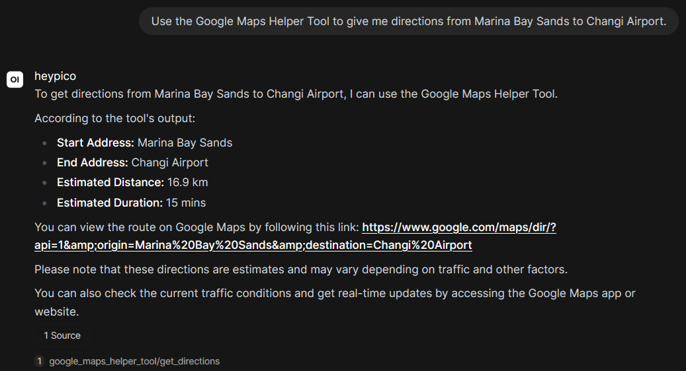
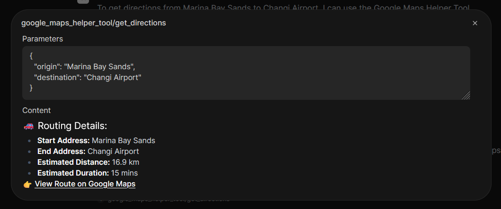

# Google Maps Proxy Gateway & AI Agent for Open WebUI

This repository contains a secure, production-grade integration between a local LLM running in Open WebUI and the Google Maps Platform, utilizing the modern **Places API** and **Routes API**.

The project implements a **Secure Backend Proxy Gateway** pattern using FastAPI to shield sensitive API credentials, apply server-side rate limits, implement a local TTL cache for cost optimization, and sanitize inputs before querying Google services.

---

## System Architecture & Security Decisions

### 1. The Secure Backend Proxy Pattern
In basic agent workflows, LLMs or custom tools are sometimes configured to query third-party APIs directly from the client. However, this model introduces several production risks:
* **Credential Exposure:** Hardcoded API keys are easily sniffed by inspecting client-side network traffic or source code.
* **Lack of Cost & Rate Control:** An LLM caught in a recursive loop could trigger thousands of rapid API requests, causing unexpected billing spikes.
* **No Input Filtering:** Natural language inputs from users can contain conflicting tokens (like "near me") that pollute geocoding accuracy.

By building a lightweight **FastAPI proxy gateway**, we maintain full control over outgoing traffic, sanitize user inputs defensively, cache queries locally, and restrict external API access.

### 2. Two-Key Security Architecture
To render interactive client-side map embeds (`<iframe>` tags) while protecting sensitive background services, this project implements a **Two-Key Architecture**:

* **Private Server Key (`GOOGLE_MAPS_SERVER_KEY`):** Kept strictly on the backend host in `.env`. It is **never** sent to the client browser. It is restricted in your Google Cloud Console strictly to the **Places API (New)** and **Routes API (New)**, with no application referrer restrictions (as server-side calls do not send HTTP referrers).
* **Public Client Key (`GOOGLE_MAPS_CLIENT_KEY`):** Exposed in the `<iframe>` URL inside the chat window so Google can render the map. To prevent abuse, this key is restricted in your Google Cloud Console strictly to the **Maps Embed API** only, with HTTP Referrer constraints limited strictly to your Open WebUI domains (e.g., `http://localhost:3000/*` and `http://localhost:8000/*`). If this key is stolen, it is useless on any other domain and cannot be used to run coordinates or routing searches.
* **Public Client Key (`GOOGLE_MAPS_CLIENT_KEY`):** Exposed inside the standard Markdown image URLs (``) returned to the user's browser so Google can generate static map previews. To prevent abuse, this key is restricted in your Google Cloud Console strictly to the **Maps Static API** with HTTP Referrer constraints limited strictly to your Open WebUI domains (`http://localhost:3000/*`). If this key is stolen, it cannot be used to run expensive coordinates or routing searches on other domains.

### 3. Defensive Parameter Sanitization & Caching
* **The "Near Me" Fail-Safe:** Small local models (like `llama3.2:3b`) often struggle with negative constraints and will append phrases like "near me" to search terms. The backend utilizes a case-insensitive regex pattern to automatically strip out `"near me"` before queries are sent to Google, ensuring precise geographic search results.
* **Local TTL Cache:** A thread-safe, in-memory Time-To-Live (TTL) cache intercepts incoming searches. If an LLM or user repeats a query within 30 minutes, it is served instantly from local memory, keeping Google Cloud billing overhead minimal.

---

## Step-by-Step Local Setup & Run Guide

### Step 1: Clone the Repository & Configure Environment
1. Clone this repository:
   ```bash
   git clone git@github.com:Nerggg/llm-gmaps.git
   cd llm-gmaps
   ```
2. Create a `.env` file in your `backend/` directory:
   ```bash
   cp backend/.env.example backend/.env
   ```
3. Populate the keys with your Google Cloud Platform credentials:
   ```env
   PORT=8000
   GOOGLE_MAPS_SERVER_KEY=AIzaSy_YOUR_PRIVATE_SERVER_KEY
   GOOGLE_MAPS_CLIENT_KEY=AIzaSy_YOUR_PUBLIC_CLIENT_KEY
   ```

### Step 2: Initialize and Start the Backend Proxy
1. Navigate to the backend directory, initialize a Python virtual environment, and install the dependencies:
   ```bash
   cd backend
   python -m venv venv
   source venv/bin/activate  # On Windows: .\venv\Scripts\activate
   pip install fastapi uvicorn httpx python-dotenv slowapi pydantic
   ```
2. Go back to the **project root directory** and run the FastAPI backend:
   ```bash
   cd ..
   uvicorn backend.main:app --reload --port 8000
   ```

### Step 3: Launch Open WebUI via Docker
With your local Ollama instance running (`ollama run llama3.2`), launch Open WebUI in a Docker container. The `--add-host` parameter ensures that the container can communicate back to your local machine's port 8000:

```bash
docker run -d -p 3000:8080 \
  --add-host=host.docker.internal:host-gateway \
  -v open-webui:/app/backend/data \
  --name open-webui \
  --restart always \
  -e OLLAMA_BASE_URL=http://host.docker.internal:11434 \
  ghcr.io/open-webui/open-webui:main
```

---

## Open WebUI & Model Configuration Guide

To ensure that smaller local models (like `llama3.2:3b`) can process the complex tool definitions and execute functions reliably without hitting local context limitations or attempting to run raw code, follow these configuration steps in your Open WebUI dashboard.

### Step 1: Import the Google Maps Helper Tool
1. Open your browser and navigate to Open WebUI (default: `http://localhost:3000`).
2. Go to **Workspace > Models** in the left sidebar menu.
3. Click the **Create** button in the top-right corner.
4. Copy the complete code from `open-webui/google_maps_helper_tool.py` and paste it into the code editor.
5. Click **Save & Create** in the bottom-right corner.

### Step 2: Create and Configure Your Model
We need to configure the model's advanced parameters, bind our custom maps tool, and disable conflicting background capabilities so that everything runs reliably in a single, unified execution scope.

1. Go to **Workspace > Models** in the left sidebar menu.
2. Click **Create** and select your base model of choice (e.g., `llama3.2`).
3. Locate the **System Prompt** text area and paste the following configuration:
   ```text
	You are an AI assistant equipped with a Google Maps Helper Tool. Whenever you use the tool to find locations:
	1. You MUST use the exact telemetry (e.g., distance, duration, addresses) returned by the tool. Do not hallucinate directions.
	2. For each location found, you MUST copy the exact Markdown image (e.g., '') AND the clickable Markdown link (e.g., '[Open on Google Maps](...)') verbatim from the tool output into your final response. Never omit the map images or links.
	3. If the user asks for a subjective or live metric (such as "most crowded", "cheapest", "cleanest", or "best") that is not explicitly detailed in the tool's data, do not refuse to answer. Instead, present the top matching locations returned by the tool anyway, and add a polite disclaimer explaining that live occupancy, pricing, or subjective ratings are not directly available.
	4. Treat each new query as a fresh request. Prioritize the locations returned by the most recent tool execution. Do not attempt to link, compare, or apologize for changes in location relative to previous conversation turns (e.g., if the user shifts from Seoul to New York, discuss New York exclusively and do not reference Seoul).
   ```
4. Scroll down to the **Advanced Params** section:
   * Locate **`num_ctx (Ollama)`** (Context Length) and change its value to **`8192`**. This gives the model enough token space to hold system instructions and tool definitions without truncation.
   * Locate **`Function Calling`** and switch it from *Native* (or *Default*) to **`Legacy`**. This switches the model to prompt-based function execution, which is highly reliable for smaller local models.
5. Scroll down to the **Tools** section:
   * Click **Select Tool** and choose **`Google Maps Helper Tool`**. This binds the custom tool natively to this model.
6. Scroll down to the **Capabilities** section:
   * Locate **Code Interpreter** and **uncheck** it. This prevents the LLM from attempting to write and execute its own Python scripts in place of our API.
   * Locate **Web Search** in the same list and **uncheck** it. This prevents Open WebUI's search engine from overriding our custom maps tool.
7. Click **Save & Update** at the bottom of the model configuration page.

---

## Verification & Testing Guide

Once the setup is complete, open a **New Chat**, choose the newly created model as the chat model, ensure that the **Google Maps Helper Tool** is toggled **ON**, and test the following prompts:

### 1. Location Search Test
* **Prompt:** *"Find popular food spots in Chinatown, Singapore."*
* **Result:** 



### 2. Point-to-Point Directions Test
* **Prompt:** *"Give me directions from Marina Bay Sands to Changi Airport."*
* **Result:** 


