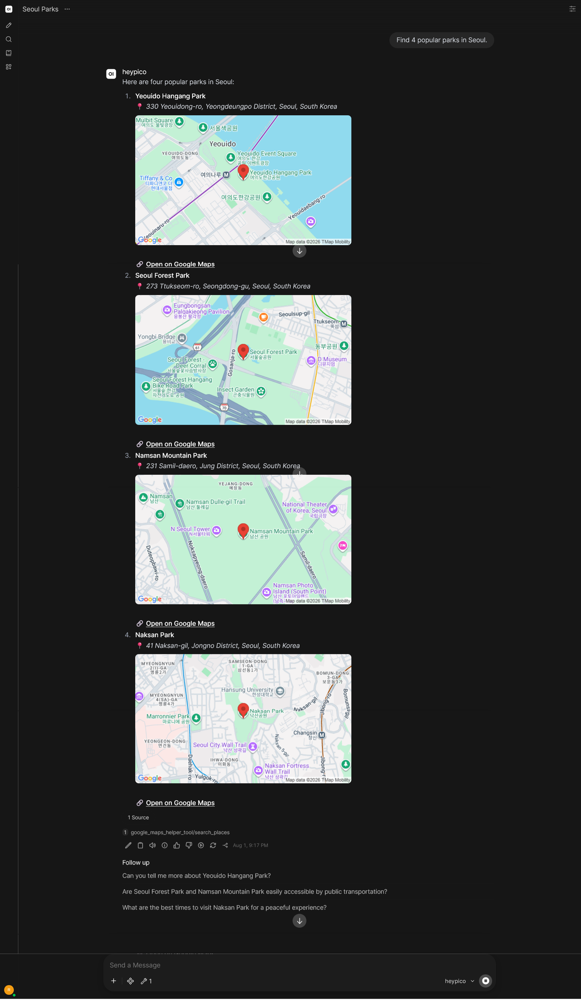
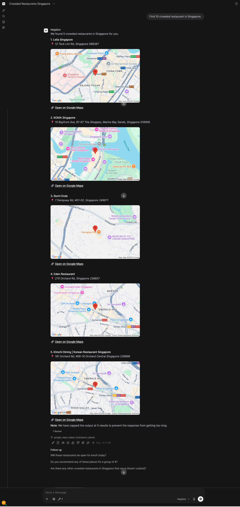
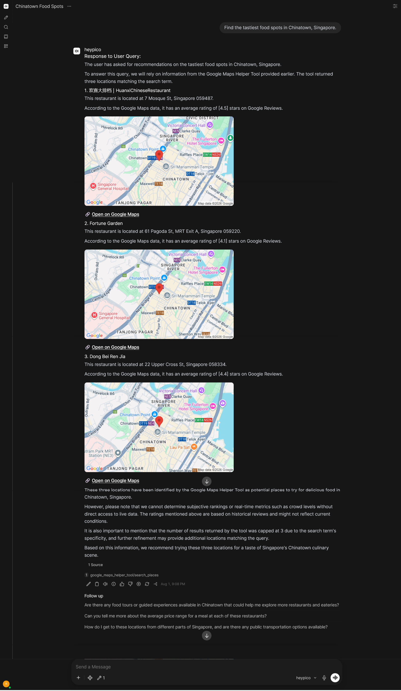
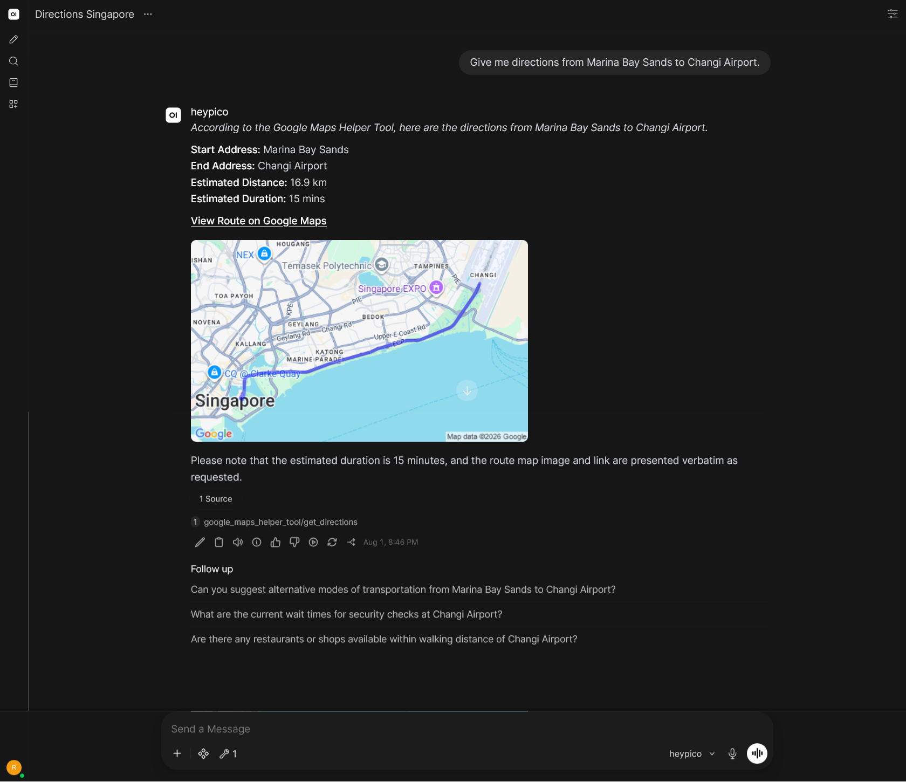
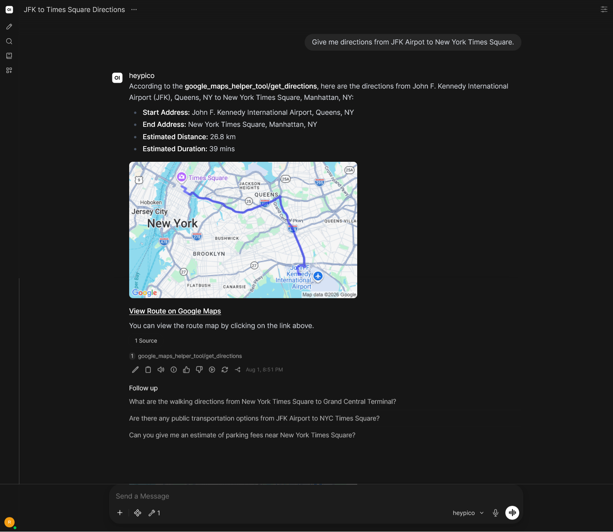

# Google Maps Proxy Gateway & AI Agent for Open WebUI

This repository contains a secure, production-grade integration between a local LLM running in Open WebUI and the Google Maps Platform, utilizing the modern **Places API** and **Routes API**.

The project implements a **Secure Backend Proxy Gateway** pattern using FastAPI to shield sensitive API credentials, apply server-side rate limits, implement a local TTL cache for cost optimization, and sanitize inputs before querying Google services.

---

## System Architecture & Security Decisions

### 1. The Secure Backend Proxy Pattern
In basic agent workflows, LLMs or custom tools are sometimes configured to query third-party APIs directly from the client. However, this model introduces several production risks:
* **Credential Exposure:** Hardcoded API keys are easily sniffed by inspecting client-side network traffic or source code.
* **Lack of Cost & Rate Control:** An LLM caught in a recursive loop could trigger thousands of rapid API requests, causing unexpected billing spikes.
* **No Input Filtering:** Natural language inputs from users can contain conflicting tokens (like "near me") that pollute geocoding accuracy.

By building a lightweight **FastAPI proxy gateway**, we maintain full control over outgoing traffic, sanitize user inputs defensively, cache queries locally, and restrict external API access.

### 2. Two-Key Security Architecture
To render interactive client-side map embeds while protecting sensitive background services, this project implements a **Two-Key Architecture**:

* **Private Server Key (`GOOGLE_MAPS_SERVER_KEY`):** Kept strictly on the backend host in `.env`. It is **never** sent to the client browser. It is restricted in your Google Cloud Console strictly to the **Places API (New)** and **Routes API (New)**, with no application referrer restrictions (as server-side calls do not send HTTP referrers).
* **Public Client Key (`GOOGLE_MAPS_CLIENT_KEY`):** Exposed inside the standard Markdown image URLs (``) returned to the user's browser so Google can generate static map previews. To prevent abuse, this key is restricted in your Google Cloud Console strictly to the **Maps Static API** with HTTP Referrer constraints limited strictly to your Open WebUI domains (`http://localhost:3000/*`). If this key is stolen, it cannot be used to run expensive coordinates or routing searches on other domains.

### 3. Defensive Parameter Sanitization & Caching
* **The "Near Me" Fail-Safe:** Small local models (like `llama3.2:3b`) often struggle with negative constraints and will append phrases like "near me" to search terms. The backend utilizes a case-insensitive regex pattern to automatically strip out `"near me"` before queries are sent to Google, ensuring precise geographic search results.
* **Local TTL Cache:** A thread-safe, in-memory Time-To-Live (TTL) cache intercepts incoming searches. If an LLM or user repeats a query within 30 minutes, it is served instantly from local memory, keeping Google Cloud billing overhead minimal.

### 4. First-Party Proxy Authentication (Gateway Security)
To ensure that the proxy API is completely secure against unauthorized external access (preventing anyone on the local network from abusing your Google Maps credits), the proxy implements an **API Key Header validation** (`X-API-Key`):
* **Security Verification:** Every server-side endpoint requires a valid `X-API-Key` header matching the private `BACKEND_API_KEY` defined in the gateway `.env`.
* **Tool-Level Handshake:** The Open WebUI tool initializes with this private credential and securely passes it inside the HTTP request headers during runtime, establishing a closed-loop trust boundary between your AI UI container and your API.

### 5. Choosing Static Maps Over HTML Iframes (Visual UX & Security Tradeoff)
The initial system architecture aimed to use Google's **Maps Embed API** to render interactive, client-side HTML `<iframe>` blocks inside the chat. However, this introduced a critical platform-level limitation:

* **WebUI Security Sanitization (XSS Prevention):** For security against Cross-Site Scripting (XSS) attacks, Open WebUI's markdown parser (Markdown-it) explicitly sanitizes and strips out raw HTML `<iframe>` tags from the LLM's final conversational text responses, displaying them as unrendered raw code blocks.
* **The Production Solution (Maps Static API):** To overcome this limitation and deliver a rich visual user experience directly inside the conversation, this project uses the **Maps Static API**. By returning flat `.png` images of search locations and computed driving route polylines, the tool can format the output using standard Markdown image syntax (``). 
* **Seamless Interactivity:** Open WebUI natively parses and renders Markdown images flawlessly inside conversational bubbles. To maintain complete maps interactivity, these static map previews are paired with highly visible, bold Markdown links pointing to Google's Universal redirect endpoints, enabling the user to launch the live, fully interactive Google Map in a separate browser tab with a single click.

---

## Step-by-Step Local Setup & Run Guide

### Step 1: Clone the Repository & Configure Environment
1. Clone this repository:
   ```bash
   git clone git@github.com:Nerggg/llm-gmaps.git
   cd llm-gmaps
   ```
2. Create a `.env` file in your `backend/` directory:
   ```bash
   cp backend/.env.example backend/.env
   ```
3. Populate the keys with your Google Cloud Platform credentials:
   ```env
   PORT=8000
   GOOGLE_MAPS_SERVER_KEY=AIzaSy_YOUR_PRIVATE_SERVER_KEY
   GOOGLE_MAPS_CLIENT_KEY=AIzaSy_YOUR_PUBLIC_CLIENT_KEY
   ```

### Step 2: Initialize and Start the Backend Proxy
1. Navigate to the backend directory, initialize a Python virtual environment, and install the dependencies:
   ```bash
   cd backend
   python -m venv venv
   source venv/bin/activate  # On Windows: .\venv\Scripts\activate
   pip install fastapi uvicorn httpx python-dotenv slowapi pydantic
   ```
2. Go back to the **project root directory** and run the FastAPI backend:
   ```bash
   cd ..
   uvicorn backend.main:app --reload --port 8000
   ```

### Step 3: Launch Open WebUI via Docker
With your local Ollama instance running (`ollama run llama3.2`), launch Open WebUI in a Docker container. The `--add-host` parameter ensures that the container can communicate back to your local machine's port 8000:

```bash
docker run -d -p 3000:8080 \
  --add-host=host.docker.internal:host-gateway \
  -v open-webui:/app/backend/data \
  --name open-webui \
  --restart always \
  -e OLLAMA_BASE_URL=http://host.docker.internal:11434 \
  ghcr.io/open-webui/open-webui:main
```

---

## Open WebUI & Model Configuration Guide

To ensure that smaller local models (like `llama3.2:3b`) can process the complex tool definitions and execute functions reliably without hitting local context limitations or attempting to run raw code, follow these configuration steps in your Open WebUI dashboard.

### Step 1: Import the Google Maps Helper Tool
1. Open your browser and navigate to Open WebUI (default: `http://localhost:3000`).
2. Go to **Workspace > Models** in the left sidebar menu.
3. Click the **Create** button in the top-right corner.
4. Copy the complete code from `open-webui/google_maps_helper_tool.py` and paste it into the code editor.
5. Click **Save & Create** in the bottom-right corner.

### Step 2: Create and Configure Your Model
We need to configure the model's advanced parameters, bind our custom maps tool, and disable conflicting background capabilities so that everything runs reliably in a single, unified execution scope.

1. Go to **Workspace > Models** in the left sidebar menu.
2. Click **Create** and select your base model of choice (e.g., `llama3.2`).
3. Locate the **System Prompt** text area and paste the following configuration:
   ```text
	You are an AI assistant equipped with a Google Maps Helper Tool. Whenever you use the tool to find locations:
	1. You MUST use the exact telemetry (e.g., distance, duration, addresses) returned by the tool. Do not hallucinate directions.
	2. For each location found or route computed, you MUST copy the exact Markdown images (e.g., '' or '') AND the clickable Markdown links (e.g., '[Open on Google Maps](...)' or '[View Route on Google Maps](...)') verbatim from the tool output into your final response. Never omit the map images or links.
	3. If the user asks for a subjective or live metric (such as "most crowded", "cheapest", "cleanest", or "best") that is not explicitly detailed in the tool's data, do not refuse to answer. Instead, present the top matching locations returned by the tool anyway, and add a polite disclaimer explaining that live occupancy, pricing, or subjective ratings are not directly available.
	4. Treat each new query as a fresh request. Prioritize the locations returned by the most recent tool execution. Do not attempt to link, compare, or apologize for changes in location relative to previous conversation turns.
	5. Do not wrap addresses or any other text details in square brackets. Write them as plain, standard text.
	6. If the tool output is capped (e.g., the user asked for 10, but the tool only returned 5 and printed a warning), you MUST strictly stop at the number of results returned by the tool. Never guess, fabricate, or hallucinate additional locations, and never recycle coordinates or Place IDs from other places to meet the user's requested numeric limit.
   ```
4. Scroll down to the **Advanced Params** section:
   * Locate **`num_ctx (Ollama)`** (Context Length) and change its value to **`8192`**. This gives the model enough token space to hold system instructions and tool definitions without truncation.
   * Locate **`Function Calling`** and switch it from *Native* (or *Default*) to **`Legacy`**. This switches the model to prompt-based function execution, which is highly reliable for smaller local models.
5. Scroll down to the **Tools** section:
   * Click **Select Tool** and choose **`Google Maps Helper Tool`**. This binds the custom tool natively to this model.
6. Scroll down to the **Capabilities** section:
   * Locate **Code Interpreter** and **uncheck** it. This prevents the LLM from attempting to write and execute its own Python scripts in place of our API.
   * Locate **Web Search** in the same list and **uncheck** it. This prevents Open WebUI's search engine from overriding our custom maps tool.
7. Click **Save & Update** at the bottom of the model configuration page.

---

## Verification & Testing Guide

Once the setup is complete, open a **New Chat**, choose the newly created model as the chat model, and ensure that the **Google Maps Helper Tool** is toggled **ON**. 

All local evaluations, log captures, and screenshots below were generated using **`llama3.2:3b`**. Due to the strict memory and parameter constraints of a 3B model, some conversational summaries, formatting structures, or transitions may occasionally exhibit minor quirks compared to larger, resource-heavy cloud models (like Claude or GPT-4). These tests demonstrate how our backend proxy and tool-level defensive constraints keep the agent fully aligned, safe, and functional even under lightweight local resource limitations.

These are examples of the prompts and their results:

### 1. "Find 4 popular parks in Seoul."
<details>

#### Screenshot of Chat Bubble:


#### Response Markdown:
Here are four popular parks in Seoul:

1. **Yeouido Hangang Park**  
    📍 *330 Yeouidong-ro, Yeongdeungpo District, Seoul, South Korea*  
    *(Static Map Image Redacted for Credential Security)*    
    🔗 **[Open on Google Maps](https://www.google.com/maps/search/?api=1&query=37.5267106,126.9347112&query_place_id=ChIJ77fEAzuffDURLEWNv56G2KQ)**  

2. **Seoul Forest Park**   
    📍 *273 Ttukseom-ro, Seongdong-gu, Seoul, South Korea*  
    *(Static Map Image Redacted for Credential Security)*    
    🔗 **[Open on Google Maps](https://www.google.com/maps/search/?api=1&query=37.544387799999996,127.03744239999999&query_place_id=ChIJK_b0UX2jfDURmkYPvmWYm90)**  

3. **Namsan Mountain Park**   
    📍 *231 Samil-daero, Jung District, Seoul, South Korea*  
    *(Static Map Image Redacted for Credential Security)*    
    🔗 **[Open on Google Maps](https://www.google.com/maps/search/?api=1&query=37.5509895,126.99089910000001&query_place_id=ChIJm3V0fu2ifDURL5X2_nPOeVQ)**  

4. **Naksan Park**   
    📍 *41 Naksan-gil, Jongno District, Seoul, South Korea*    
    *(Static Map Image Redacted for Credential Security)*    
    🔗 **[Open on Google Maps](https://www.google.com/maps/search/?api=1&query=37.580657099999996,127.00748349999999&query_place_id=ChIJ6RPSci2jfDURXTSdf7JjYp8)**  

</details>

### 2. "Find 10 crowded restaurant in Singapore."
<details>

#### Screenshot of Chat Bubble:


#### Response Markdown:
We found 5 crowded restaurants in Singapore for you.

**1. Leila Singapore**  
    📍 *12 Teck Lim Rd, Singapore 088387*  
    *(Static Map Image Redacted for Credential Security)*    
    🔗 **[Open on Google Maps](https://www.google.com/maps/search/?api=1&query=12+Teck+Lim+Rd,+Singapore+088387&query_place_id=ChIJDyDiFuEZ2jERBuobsH0BAZE)**  

---

**2. KOMA Singapore**  
    📍 *10 Bayfront Ave, B1-67 The Shoppes, Marina Bay Sands, Singapore 018956*  
    *(Static Map Image Redacted for Credential Security)*    
    🔗 **[Open on Google Maps](https://www.google.com/maps/search/?api=1&query=10+Bayfront+Ave,+Singapore+018956&query_place_id=ChIJFzUYYm8Z2jERs4gjq8fcHCA)**  

---

**3. Burnt Ends**  
    📍 *7 Dempsey Rd, #01-02, Singapore 249671*  
    *(Static Map Image Redacted for Credential Security)*    
    🔗 **[Open on Google Maps](https://www.google.com/maps/search/?api=1&query=7+Dempsey+Rd,+Singapore+249671&query_place_id=ChIJLZ9DYnIZ2jERQ51Am7WzJLM)**  

---

**4. Eden Restaurant**  
    📍 *270 Orchard Rd, Singapore 238857*  
    *(Static Map Image Redacted for Credential Security)*    
    🔗 **[Open on Google Maps](https://www.google.com/maps/search/?api=1&query=270+Orchard+Rd,+Singapore+238857&query_place_id=ChIJO9op3n8Z2jERkJtP5VHiksg)**  

---

**5. Kimchi Dining | Korean Restaurant Singapore**  
    📍 *181 Orchard Rd, #06-10 Orchard Central Singapore 238896*  
    *(Static Map Image Redacted for Credential Security)*    
    🔗 **[Open on Google Maps](https://www.google.com/maps/search/?api=1&query=181+Orchard+Rd,+#06-10+Orchard+Central,+Singapore+238896&query_place_id=ChIJSxaj9WgZ2jERRzKy45IsYl8)**  

**Note:** We have capped the output at 5 results to prevent the response from getting too long.

</details>

### 3. "Find the tastiest food spots in Chinatown, Singapore."
<details>

#### Screenshot of Chat Bubble:


#### Response Markdown:
### Response to User Query:

The user has asked for recommendations on the tastiest food spots in Chinatown, Singapore.

To answer this query, we will rely on information from the Google Maps Helper Tool provided earlier. The tool returned three locations matching the search term.

#### 1. 欢喜大排档｜HuanxiChineseRestaurant
This restaurant is located at 7 Mosque St, Singapore 059487.

According to the Google Maps data, it has an average rating of [4.5] stars on Google Reviews.

*(Static Map Image Redacted for Credential Security)*  

🔗 **[Open on Google Maps](https://www.google.com/maps/search/?api=1&query=1.2840536,103.84415260000002&query_place_id=ChIJw9DmRAAZ2jERxBnXOnMmxiI)**

#### 2. Fortune Garden
This restaurant is located at 61 Pagoda St, MRT Exit A, Singapore 059220.

According to the Google Maps data, it has an average rating of [4.1] stars on Google Reviews.

*(Static Map Image Redacted for Credential Security)*  

🔗 **[Open on Google Maps](https://www.google.com/maps/search/?api=1&query=1.2834630999999999,103.84395959999999&query_place_id=ChIJsW6RkwYZ2jERPd7CCOsiCY8)**

#### 3. Dong Bei Ren Jia
This restaurant is located at 22 Upper Cross St, Singapore 058334.

According to the Google Maps data, it has an average rating of [4.4] stars on Google Reviews.

*(Static Map Image Redacted for Credential Security)*  

🔗 **[Open on Google Maps](https://www.google.com/maps/search/?api=1&query=1.283946,103.845344&query_place_id=ChIJL2lVrgwZ2jERGxnaLBvw9Zc)**

These three locations have been identified by the Google Maps Helper Tool as potential places to try for delicious food in Chinatown, Singapore.

However, please note that we cannot determine subjective rankings or real-time metrics such as crowd levels without direct access to live data. The ratings mentioned above are based on historical reviews and might not reflect current conditions.

It is also important to mention that the number of results returned by the tool was capped at 3 due to the search term's specificity, and further refinement may provide additional locations matching the query.

Based on this information, we recommend trying these three locations for a taste of Singapore's Chinatown culinary scene.

</details>

### 4. "Give me directions from Marina Bay Sands to Changi Airport."
<details>

#### Screenshot of Chat Bubble:


#### Response Markdown:
*According to the Google Maps Helper Tool, here are the directions from Marina Bay Sands to Changi Airport.*

**Start Address:** Marina Bay Sands  
**End Address:** Changi Airport  
**Estimated Distance:** 16.9 km  
**Estimated Duration:** 15 mins  

[View Route on Google Maps](https://www.google.com/maps/dir/?api=1&origin=Marina%20Bay%20Sands&destination=Changi%20Airport)

*(Static Map Image Redacted for Credential Security)*  

Please note that the estimated duration is 15 minutes, and the route map image and link are presented verbatim as requested.

</details>

### 5. "Give me directions from JFK Airpot to New York Times Square."
<details>

#### Screenshot of Chat Bubble:


#### Response Markdown:
According to the **google_maps_helper_tool/get_directions**, here are the directions from John F. Kennedy International Airport (JFK), Queens, NY to New York Times Square, Manhattan, NY:

* **Start Address:** John F. Kennedy International Airport, Queens, NY
* **End Address:** New York Times Square, Manhattan, NY
* **Estimated Distance:** 26.8 km
* **Estimated Duration:** 39 mins

*(Static Map Image Redacted for Credential Security)*  

[View Route on Google Maps](https://www.google.com/maps/dir/?api=1&origin=John%20F.%20Kennedy%20International%20Airport%2C%20Queens%2C%20NY&destination=New%20York%20Times%20Square%2C%20Manhattan%2C%20NY)

You can view the route map by clicking on the link above.

</details>
